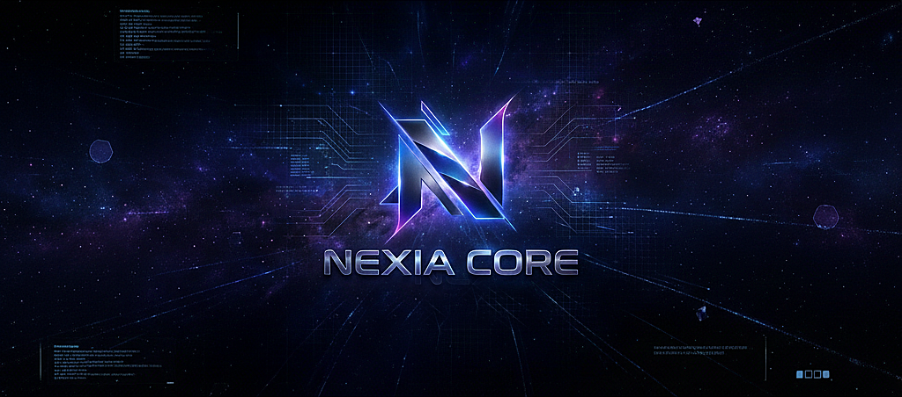

# NEXIA Core v1.0.0

**Complete Cryptocurrency Implementation**

---

# Nexia (NXE)

<div align="center">



**Nexia - The Future of Decentralized Payments**

*High-performance Scrypt-based cryptocurrency*

[](https://opensource.org/licenses/MIT)
[]()

</div>

---

## 📌 Quick Start

**Linux/macOS:**
```bash
git clone https://github.com/nexia-coin/nexia-master.git
cd nexia-core && mkdir build && cd build
cmake .. -DCMAKE_BUILD_TYPE=Release
cmake --build . -j$(nproc)
```

**Run Daemon:**
```bash
./nexiad              # Mainnet
```

**Run Wallet:**
```bash
./nexia-qt            # GUI Wallet (if Qt5 available)
nexia-cli help        # RPC commands
```

---

## ⚡ Key Features

### Technical Specifications

- **Algorithm**: Scrypt
- **Block Time**: 60 seconds

- **Algorithm**: Scrypt (ASIC and GPU-friendly)
- **Block Time**: 1 minute (60 seconds) ✅ Verified in `chainparams.cpp:79` (nPowTargetSpacing = 60)
- **Initial Block Reward**: 15,000 NXE ✅ Verified in `validation.cpp:122` (GetBlockSubsidy)
- **Inflation Model**:
  - Halving interval: 840,000 blocks (~1.6 year at 1 min/block)
  - Reward decreases by 50% each halving until reaching 0 after 64 halvings
- **Address Format**: Mainnet addresses start with **"N"**
- **Consensus**: Proof of Work (PoW)
- **Difficulty Adjustment**: LWMA v3

### Network Parameters

- **Mainnet P2P Port**: 29433
- **Mainnet RPC Port**: 29432
- **Magic Bytes**: `0x4e584941` (mainnet)

### Wallet Features

The Nexia Qt wallet includes:

- **Professional UI**: Branded splash screen
- **QR Code Support**: Generate QR codes for addresses and URIs
- **URI Support**: Send and receive using Nexia URIs (nexia:Nxxx...?amount=X)
- **User-Friendly**: Placeholders and tooltips throughout for clear UX
- **Branded Experience**: Nexia logos visible in taskbar, title bar, and throughout the interface

---

## 🌐 Network & P2P (v1.0.0+)

### Connecting Nodes

Multiple Nexia nodes automatically connect and synchronize:

```bash
# Terminal 1: Start first node
./nexiad

# Terminal 2: Start second node
./nexiad

# Nodes will automatically discover and connect!
```

### Network Components

- **Peer Management** (`net.cpp/h`) - Manages connections to other nodes
- **Block Propagation** (`net_processing.cpp/h`) - Relays blocks across the network
- **Transaction Relay** - Low-fee transactions propagate quickly
- **Address Manager** - Tracks and connects to network peers

### Mainnet vs Testnet vs Regtest (Testnet and Regtest not started yet)

```bash
# Mainnet (default) - Real blockchain, separate from others
./nexiad

# Testnet - For testing, separate test chain
./nexiad -testnet

# Regtest - Local testing blockchain (just for you)
./nexiad -regtest
```

---


## 🔌 RPC API (Full Support)

### Enabled RPC Commands

Nexia Core provides 10+ RPC commands for node management:

#### Blockchain Info
```bash
nexia-cli getblockcount              # Get current block height
nexia-cli getblock [hash]            # Get block details
nexia-cli getnetworkinfo             # Network statistics
```

#### Network Status
```bash
nexia-cli getpeerinfo                # Connected peers
nexia-cli getnetworkinfo             # Network info (connections, protocol version)
```

#### Mempool
```bash
nexia-cli getmempoolinfo             # Mempool statistics
nexia-cli estimatefee                # Recommended fee (always low on Nexia)
```

#### Wallet
```bash
nexia-cli getwalletinfo              # Wallet balance and info
```

#### Raw Transactions (Experimental)
```bash
nexia-cli getrawtransaction [txid]   # Get transaction hex
nexia-cli sendrawtransaction [hex]   # Submit raw transaction
```

### RPC Configuration

Edit `nexia.conf`:

```ini
# Enable RPC server
server=1

# RPC binding and port
rpcbind=127.0.0.1
rpcport=29432

# RPC credentials
rpcuser=yourusername
rpcpassword=yourpassword

# Restrict access (security)
rpcallowip=127.0.0.1
```

### RPC Usage Examples

```bash
# Get connection count
nexia-cli getpeerinfo

# Get wallet balance
nexia-cli getwalletinfo

# Get network info
nexia-cli getnetworkinfo

# Check mempool
nexia-cli getmempoolinfo
```

---

## 🖥️ Qt Wallet Network Indicators

The **Nexia Qt wallet** displays real-time network status:

### Status Indicators

- **Peers Connected**: Shows number of active peer connections
- **Network Status**: Offline / Synchronizing / Connected
- **Block Height**: Current chain height and sync progress
- **Recommended Fee**: Displays Nexia's low fee rate
- **Transaction History**: Updated in real-time from network

### Features

- See peer information directly in wallet
- Visual feedback of network synchronization
- Automatic fee suggestion (always low on Nexia)
- Real-time transaction relay

---

## 🚀 Getting Started

### Prerequisites

- **C++ Compiler**: GCC 7+ or Clang 5+ (C++17 support required)
- **Build Tools**: Make, CMake (3.10+)
- **Dependencies**:
  - OpenSSL (1.0.1+)
  - Boost (1.64+)
  - Qt5 (for GUI wallet, optional)
  - Berkeley DB (4.8+)

### Building on Linux

```bash
# Clone the repository
git clone https://github.com/nexia-coin/nexia-master.git
cd nexia

# Build using CMake
mkdir build && cd build
cmake ..
make

# The binaries will be in the build directory
# - nexiad (daemon)
# - nexia-qt (GUI wallet)
```

### Building on Windows

#### Using MinGW

```bash
# Use CMake with MinGW
mkdir build && cd build
cmake -G "MinGW Makefiles" ..
mingw32-make
```

#### Using Visual Studio

```bash
mkdir build && cd build
cmake -G "Visual Studio 16 2019" ..
# Open the generated .sln file in Visual Studio
```

### Building on macOS

```bash
# Install dependencies via Homebrew
brew install openssl boost qt5 berkeley-db4

# Build
mkdir build && cd build
cmake ..
make
```

---

## 💻 Usage

### Running the Daemon

```bash
# Start the Nexia daemon
./nexiad

# Start with custom data directory
./nexiad -datadir=/path/to/data

# Start on testnet
./nexiad -testnet
```

### Running the GUI Wallet

```bash
# Start the Qt wallet
./nexia-qt

# The wallet will guide you through:
# - Creating a new wallet
# - Encrypting your wallet
# - Backing up your seed phrase
```

### Creating a Node

1. **Download and Build**: Follow the build instructions above
2. **Run the Daemon**: `./nexiad`
3. **Wait for Sync**: The node will download and verify the blockchain
4. **Configure (Optional)**: Edit `~/.nexia/nexia.conf` (Linux) or `%APPDATA%\Nexia\nexia.conf` (Windows)

Example `nexia.conf`:
```ini
# Network
server=1
rpcuser=yourusername
rpcpassword=yourpassword
rpcport=29432
rpcallowip=127.0.0.1

# Connection
listen=1
port=9333
maxconnections=125
```

### Mining Nexia

#### CPU Mining

```bash
# Start mining with the daemon
./nexiad -gen -genproclimit=4

# Or use the RPC
./nexia-cli setgenerate true 4
```

#### GPU Mining

Nexia uses Scrypt, which is GPU-friendly. You can use popular Scrypt miners:

- **CGMiner**: `cgminer --scrypt -o http://localhost:9332 -u rpcuser -p rpcpassword`
- **BFGMiner**: `bfgminer --scrypt -o http://localhost:9332 -u rpcuser -p rpcpassword`

#### Mining Pools

Join a mining pool for more consistent rewards:

1. Find a Nexia mining pool
2. Configure your miner with the pool's address
3. Start mining!

### Using the Wallet

#### Sending Nexia

1. Open the **Send** tab in the wallet
2. Enter the recipient's address (must start with "N" for mainnet)
3. Enter the amount in NXE
4. Review the transaction fee (low fees for Nexia)
5. Click **Send**

#### Receiving Nexia

1. Open the **Receive** tab
2. Click **Generate New Address** (if needed)
3. Share your address or QR code with the sender
4. Addresses start with "N" on mainnet

#### QR Codes

The wallet supports QR codes for:
- **Receiving**: Share your address via QR code
- **Sending**: Scan QR codes to quickly enter recipient addresses
- **Payment URLs**: Scan nexia: URLs for quick payments

---

## 🔧 Configuration

### Data Directory

- **Linux**: `~/.nexia/`
- **Windows**: `%APPDATA%\Nexia\`
- **macOS**: `~/Library/Application Support/Nexia/`

### Configuration File

Create `nexia.conf` in your data directory:

```ini
# Network
testnet=0
regtest=0

# RPC
server=1
rpcuser=yourusername
rpcpassword=yourpassword
rpcport=29432
rpcallowip=127.0.0.1

# Connection
listen=1
port=29433
maxconnections=125

# Mining
gen=0
genproclimit=-1

# Wallet
keypool=100
paytxfee=0.0001

# Logging
debug=0
logtimestamps=1
```

## 🔐 Security

### Wallet Security

- **Encryption**: Wallet encryption is supported and recommended
- **Private Keys**: Stored securely in the wallet file
- **Seed Phrases**: 12 or 24-word mnemonic seeds for backup
- **Best Practices**:
  - Always encrypt your wallet
  - Back up your seed phrase in a secure location
  - Never share your private keys or seed phrase
  - Use strong passwords

### RPC Security

- **Authentication**: Always set `rpcuser` and `rpcpassword`
- **Access Control**: Use `rpcallowip` to restrict RPC access
- **TLS**: Consider using TLS for RPC connections in production

---

## 📚 Documentation

### For Users

- [Wallet Guide](docs/wallet-guide.md)
- [Mining Guide](docs/mining-guide.md)
- [FAQ](docs/faq.md)

### For Developers

- [Building from Source](docs/build.md)
- [Contributing](CONTRIBUTING.md)
- [API Documentation](docs/api.md)

### For Miners

- [Mining Setup](docs/mining-setup.md)
- [Pool Configuration](docs/pool-config.md)
- [Hardware Recommendations](docs/hardware.md)

---

## 🤝 Contributing

Nexia is an open-source project, and we welcome contributions!

1. Fork the repository
2. Create a feature branch (`git checkout -b feature/amazing-feature`)
3. Commit your changes (`git commit -m 'Add amazing feature'`)
4. Push to the branch (`git push origin feature/amazing-feature`)
5. Open a Pull Request

Please read [CONTRIBUTING.md](CONTRIBUTING.md) for details on our code of conduct and development process.

---

## 📄 License

This project is licensed under the MIT License - see the [COPYING](COPYING) file for details.

---

## 🙏 Acknowledgments

- **Litecoin Project**: For the excellent codebase that Nexia is based on
- **Bitcoin Core**: For the foundational blockchain technology
- **The Community**: For support, testing, and contributions

---

## 📞 Contact & Support

- **Website**: [https://nexia.org](https://nexiacoin.org/)
- **GitHub**: [https://github.com/nexia-coin/nexia-master](https://github.com/nexia-coin/nexia-master)
- **Discord**: [Join our Discord](https://discord.gg/Y9EkSzV2)

---

## ⚠️ Disclaimer

Nexia is experimental software. Use at your own risk. The developers and contributors are not responsible for any loss of funds or other damages.

---

## 📜 Legal & Credits

### Licensing & Attribution

**NEXIA CORE v1.0.0** is built upon the proven foundations of Bitcoin Core and Litecoin.

#### Copyright Notices

```
This project is based on Bitcoin Core and Litecoin Core.

Bitcoin Core © 2009-2024 Bitcoin Core Developers
Litecoin Core © 2011-2024 Litecoin Developers  
Nexia © 2026 Nexia Developers

All modifications and original code are distributed under the MIT License.
```

#### IMPORTANT LEGAL NOTICE

- **Nexia is NOT Bitcoin**: This is an independent blockchain project, distinct from Bitcoin.
- **Nexia is NOT Litecoin**: While inspired by Litecoin's architecture, Nexia is a separate network.
- **No Affiliation**: Nexia is not endorsed by, affiliated with, or related to Bitcoin or Litecoin projects.
- **Independent Project**: Nexia is maintained by the Nexia community and independent developers.

#### Code Attribution

The following components are derived from upstream projects with significant modifications:

| Component | Source | License |
|-----------|--------|---------|
| Blockchain Core | Bitcoin/Litecoin | MIT |
| Consensus Rules | Bitcoin/Litecoin | MIT |
| Qt Wallet UI | Qt Project | LGPL/MIT |
| Cryptography | OpenSSL | Apache/BSD |
| Serialization | Bitcoin/Litecoin | MIT |
| Mining System | Bitcoin/Litecoin | MIT |

#### Contributor Guidelines

When contributing to Nexia, please:
1. Include proper copyright headers with your name/organization
2. Document any code derived from other projects
3. Respect all upstream licenses
4. Maintain clear attribution in comments

#### License Compliance

- Full MIT License text: See [COPYING](COPYING) file
- This project maintains MIT license compatibility
- All dependencies are compatible with MIT licensing

---

<div align="center">

**Built with ❤️ by the Nexia Community**

*Standing on the shoulders of Bitcoin and Litecoin*

*Inspired by the cosmos. Powered by open-source collaboration.*

v1.0.0 - Minimal Functional Release

</div>
